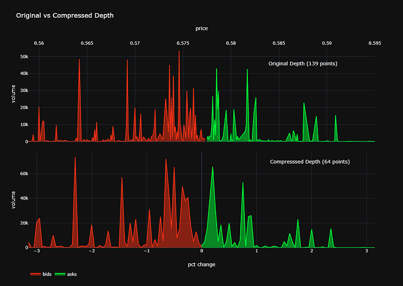

# Project Title

## Overview

This project provides a robust solution for real-time cryptocurrency data collection from two primary sources: Binance, one of the world's leading cryptocurrency exchanges, and TradingView, offering a variety of trading indicators and analytics. The project's core functionality centers around asynchronous data collection, enabling rapid and efficient data retrieval. Moreover, it offers robust data processing and analysis capabilities to support various applications, including trading strategies, investment decisions, and data-driven insights.

### Data Sources

- **Binance**: The project collects real-time depth data for various cryptocurrency pairs from Binance, a globally recognized cryptocurrency exchange.

- **TradingView**: In addition to Binance data, the project seamlessly integrates with TradingView to access a wide range of trading indicators and analytical tools. This integration empowers you with comprehensive data for informed analysis and decision-making.

### Asynchronous Data Collection

Designed for speed and efficiency, the project's data collection process is asynchronous, allowing you to fetch data at high speeds. You can configure data collection intervals to suit your needs, such as every 10 seconds.

### Data Processing and Analysis

Beyond data collection, the project offers robust data processing capabilities. You can efficiently process and analyze the collected data, making it suitable for diverse applications, including the development of trading strategies, investment decision support, and data-driven insights.

Here is an example of filter.py work:
[](https://chart-studio.plotly.com/~tikhon.radk/11#/)[Dashboard](https://chart-studio.plotly.com/~tikhon.radk/11#/)


### Extensibility and Custom Events

The project's architecture encourages extensibility. You are invited to create new events and seamlessly connect them to the Router. This flexibility empowers you to tailor the project to your specific requirements. Whether you are building a trading strategy, a machine learning model, or any other application, the modular design and event-driven architecture make it easy to expand and adapt the project to your unique needs.

This collaborative approach invites contributors and users to work together, share custom events, and explore innovative use cases in the dynamic realm of cryptocurrency data analysis and trading.

## Usage

### 1. [process_handler.py](https://github.com/Tikhon-Radkevich/CryptoModel/blob/main/process_handler.py)

- **Event Processing Order**: Events are processed in the order: `depth_update` -> `analysis_update` -> `save_data`
- **Event Handling Sequence**: Events are processed in the order in which they were created.
- **Executor Pool**: Handlers are executed in an executor pool, allowing the use of blocking functions. However, be mindful of meeting the `UPDATE_TIME`
- **Custom Data Saving**: You are not required to save data at every iteration. You can customize the `Storage` object and set the saving period as per your requirements.

### 2. [main.py](https://github.com/Tikhon-Radkevich/CryptoModel/blob/main/main.py)

- **Binance API Documentation**: Check the Binance API documentation for weight limits. You must fit within the 6,000 weight limit (needed for socket snapshot). [Binance API Documentation](https://binance-docs.github.io/apidocs/spot/en/#order-book)
- **Trading View Intervals**: All available TradingView intervals are defined in `config.py`.
- **Custom Routes**: You can add any number of routes, and they will be processed in the order of their addition.

### 3. [config.py](https://github.com/Tikhon-Radkevich/CryptoModel/blob/main/config.py)

## Data Storage Example
When I collected data, I used the following structure:
``` python
{
  "time_1_ms": {
    "symbol": "SYMBOL/PAIR", 
    "bids": [[price_1, volume_1], ..., [price_2000, volume_2000]], 
    "asks": [[price_1, volume_1], ..., [price_2000, volume_2000]],
    "TA": {
      "1m": {
        "analysis": {"RECOMMENDATION": str, "BUY": int, "SELL": int, "NEUTRAL": int}, 
        "indicators": {...}
      },
      ...,
      ...,
      ...,
      "1d": {
        "analysis": {...},
        "indicators": {...}
      }
    }
  },
  ...,
  ...,
  ...,
  "time_n_ms": {....}
}
```

